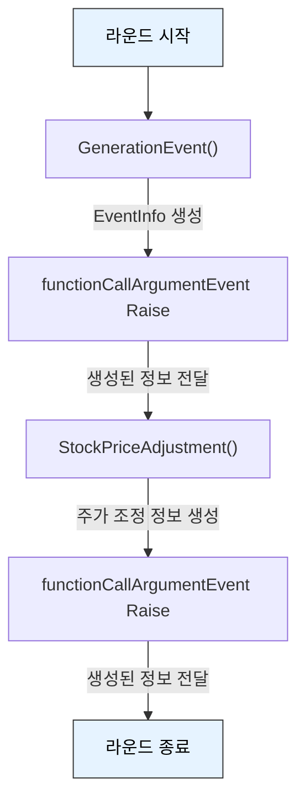
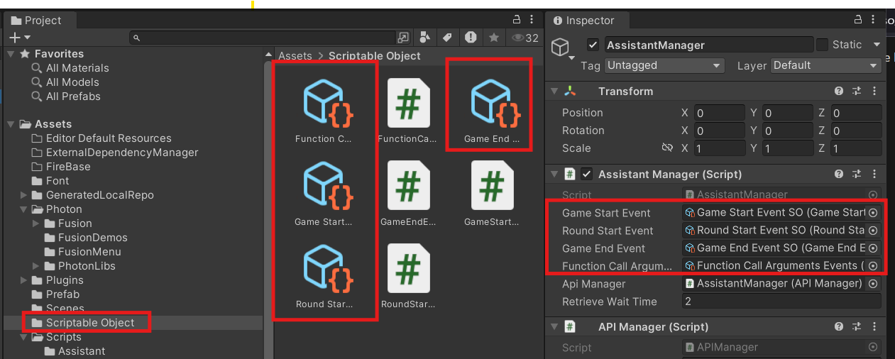

# Assistant Data 구조

# enum SectorType {}

| Sector Type | 한글 명칭 |
| --- | --- |
| Energy | 에너지 |
| Technology | 기술 |
| Finance | 금융 |
| Healthcare | 의료 |
| ConsumerDiscretionary | 임의소비재 |
| ConsumerStaples | 필수소비재 |
| Telecom | 통신 |
| Industrials | 산업재 |
| Materials | 소재 |
| RealEstate | 부동산 |

# Generation Event Json 구조

데이터 구조를 최대한 유지하면서 생성되는 답변의 품질을 개선할 예정입니다.

일반 배열처럼 접근하여 사용할 수 있습니다.

## Input Parameter

```json
{
	["specialEventInfo"] = "", // 특별 이벤트 정보, 사건 생성에 영향
	["generationSpecialEvent"] = false, // 특별 이벤트 생성 여부 
	["generationUnexpectedEvent"] = false, // 예상치 못한(독특한) 사건 생성 여부
	["eventSector"] = {"Energy","Material","RealEstate"} // SectorType Enum에서 무작위로 선택
}
```

확장성을 고려하여 설계되었으며, 향후 구성 요소를 추가하거나 제거할 수 있습니다.

## Function Call Arguments

```json
Function Call Arguments: {
  "events": [
    {
      "title": "금융시장 혼란",
      "description": "최근 금융 규제 변화와 투자 불안정으로 주요 은행들이 타격을 받고 있습니다. 금융 부문에 부담이 증가하는 양상입니다. (Finance : - 효과 예상 )"
    },
    {
      "title": "소비 트렌드 변화",
      "description": "새로운 모바일 쇼핑 플랫폼이 인기를 끌면서 소비자들의 여가 지출이 활발해지고 있습니다. 소비자재 분야에 긍정적인 영향을 미칠 전망입니다. (ConsumerDiscretionary : + 효과 예상)"
    },
    {
      "title": "필수품 가격 상승",
      "description": "세계적인 공급망 문제와 원자재 가격 인상으로 인해 식료품 및 생활용품 가격이 급등하고 있습니다. 필수소비재 시장에 부정적인 영향을 줄 수 있습니다. (ConsumerStaples : - 효과 예상)"
    }
  ],
  "generateSpecialEvent": false
}
```

# Stock Price Adjustment Json 구조

## Input Parameter

- Generation Event에서 생성된 Function Call Arguments

## Function Call Arguments

```json
Function Call Arguments: {
  "eventInfo": [
    {
      "title": "금융시장 혼란",
      "description": "최근 금융 규제 변화와 투자 불안정으로 주요 은행들이 타격을 받고 있습니다. 금융 부문에 부담이 증가하는 양상입니다. (Finance : - 효과 예상 )",
      "affectedSectors": [
        "Finance"
      ],
      "impactDirection": "-"
    },
    {
      "title": "소비 트렌드 변화",
      "description": "새로운 모바일 쇼핑 플랫폼이 인기를 끌면서 소비자들의 여가 지출이 활발해지고 있습니다. 소비자재 분야에 긍정적인 영향을 미칠 전망입니다. (ConsumerDiscretionary : + 효과 예상)",
      "affectedSectors": [
        "ConsumerDiscretionary"
      ],
      "impactDirection": "+"
    },
    {
      "title": "필수품 가격 상승",
      "description": "세계적인 공급망 문제와 원자재 가격 인상으로 인해 식료품 및 생활용품 가격이 급등하고 있습니다. 필수소비재 시장에 부정적인 영향을 줄 수 있습니다. (ConsumerStaples : - 효과 예상)",
      "affectedSectors": [
        "ConsumerStaples"
      ],
      "impactDirection": "-"
    }
  ],
  "predefinedSectors": [
    "Energy",
    "Technology",
    "Finance",
    "Healthcare",
    "ConsumerDiscretionary",
    "ConsumerStaples",
    "Telecom",
    "Industrials",
    "Materials",
    "RealEstate"
  ]
}
```

# Event

## 이벤트 구조



## 사용 예시

```csharp
using UnityEngine;
using Newtonsoft.Json.Linq;

public class FunctionCallArgumentsReceiver : MonoBehaviour
{
    public functionCallArgumentsEvents functionCallArgumentsEventChannel;

    private void OnEnable()
    {
        if (functionCallArgumentsEventChannel != null)
        {
            functionCallArgumentsEventChannel.OnEventRaised.AddListener(OnArgumentsReceived);
        }
    }

    private void OnDisable()
    {
        if (functionCallArgumentsEventChannel != null)
        {
            functionCallArgumentsEventChannel.OnEventRaised.RemoveListener(OnArgumentsReceived);
        }
    }

    private void OnArgumentsReceived(JObject args)
    {
        Debug.Log("Received function call arguments: " + args.ToString());
        // 로직 구현
    }
}
```



functionCallArgumentsEvents 스크립터블 오브젝트를 등록해야만 정상적으로 작동합니다.